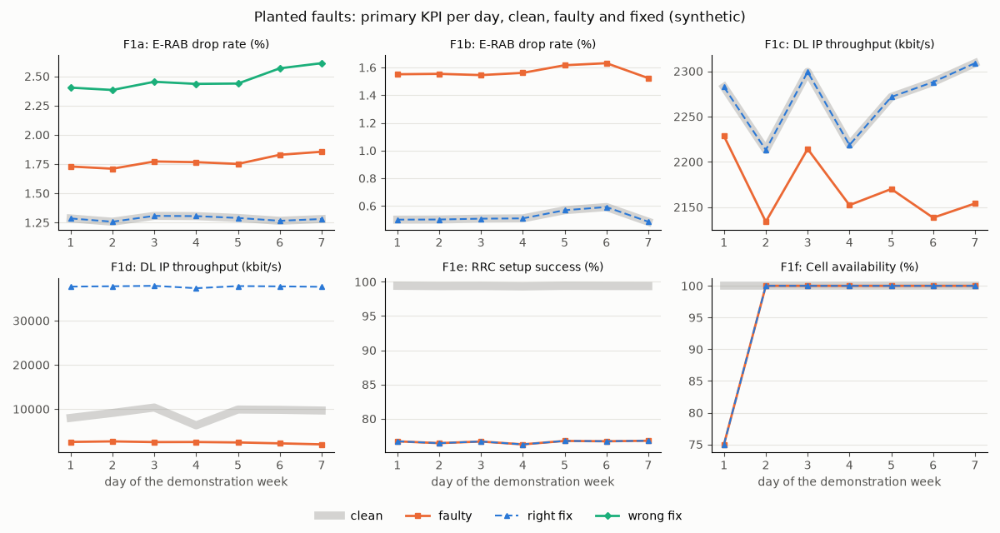

# Planted faults and what-if report

Synthetic network (rules F1-F4, M6). Every fault is a change inside the network model;
the what-if replays a week with the same random noise (common random numbers). Each kind
is demonstrated on its own cell for the first week of the run, outside the planted
schedule; the schedule itself appears only as counts and aggregate recovery, since its
answers are evaluation-only (rule A3). Written by `python -m ran_lakehouse.faults.report`
from `faults.json`.

## Fault kinds

| Kind | Cause | Change in the model (START) | Duration, h | Right answer | Primary KPI |
|---|---|---|---|---|---|
| F1a | electrical tilt changed by mistake; the cell overshoots | tilt set to 0 deg (urban cells) | 48-144 | restore tilt | E-RAB drop rate (%), area |
| F1b | neighbour relation deleted from the neighbour list | strongest neighbour relation deleted | 48-144 | add neighbour | E-RAB drop rate (%), cell |
| F1c | transmit power reduced after maintenance | power -6 dB | 48-144 | restore power | DL IP throughput (kbit/s), area |
| F1d | traffic surge in the cell's area | persons x2.5 within 0.6 km (suburban cells) | 24-72 | load-balancing offset or capacity note | DL IP throughput (kbit/s), cell |
| F1e | external uplink interference source | uplink source 0.1-0.3 km along the azimuth, raising the cell's uplink noise by 15 dB | 48-168 | no parameter fix, field visit | RRC setup success (%), cell |
| F1f | cell out of service | cell down | 3-12 | no parameter fix, alarm-driven | Cell availability (%), cell |

Recovery = (fixed - faulty) / (clean - faulty) on the primary KPI: 1 restores the clean
value, 0 does nothing, below 0 makes it worse.

## F1a: electrical tilt changed by mistake; the cell overshoots

Cell ENB0026_B3_1 (urban, huawei-style), 2026-01-05T00:00:00 to 2026-01-12T00:00:00.

PM, KPIs over the week (clean / faulty / fixed):

| KPI | Cell | Area (cell and touched cells) |
|---|---|---|
| E-RAB accessibility (%) | 97.721 / 90.777 / 97.721 | 95.563 / 95.666 / 95.563 |
| RRC setup success (%) | 98.505 / 93.537 / 98.505 | 97.012 / 97.078 / 97.012 |
| E-RAB drop rate (%) | 1.118 / 5.781 / 1.118 | 1.285 / 1.77 / 1.285 |
| DL IP throughput (kbit/s) | 22532.206 / 576.937 / 22532.206 | 2265.713 / 1985.245 / 2265.713 |
| Handover success (%) | 98.355 / 97.029 / 98.355 | 98.18 / 98.195 / 98.18 |
| Mean DL PRB use (%) | 11.394 / 73.967 / 11.394 | 32.475 / 35.325 / 32.475 |
| RRC connections, mean | 2.722 / 11.003 / 2.722 | 126.307 / 126.326 / 126.307 |
| Cell availability (%) | 100.0 / 100.0 / 100.0 | 100.0 / 100.0 / 100.0 |

PM traces (clean, faulty):

- subscribers served by the cell: [324, 1171]
- cells touched: 13
- share of users beyond 16 TA steps: [0.0, 0.402]

CM change log:

- 2026-01-05T00:00:00 SubNetwork=RanLake,SubNetwork=West,ManagedElement=ENB0026,ENBFunction=1,EUtranCellFDD=ENB0026_B3_1 electricalTiltDeg: 8 to 0
- 2026-01-12T00:00:00 SubNetwork=RanLake,SubNetwork=West,ManagedElement=ENB0026,ENBFunction=1,EUtranCellFDD=ENB0026_B3_1 electricalTiltDeg: 0 to 8

FM alarm log:

- none

Right answer: restore tilt (what-if: tilt +2, tilt +2, tilt +2, tilt +2). Recovery (area): 1.0; over the area: 1.0.

Wrong fix, power +3 dB on the overshooting cell: recovery -1.433.

## F1b: neighbour relation deleted from the neighbour list

Cell ENB0218_B3_3 (suburban, nokia-style), 2026-01-05T00:00:00 to 2026-01-12T00:00:00.

PM, KPIs over the week (clean / faulty / fixed):

| KPI | Cell | Area (cell and touched cells) |
|---|---|---|
| E-RAB accessibility (%) | 98.858 / 98.858 / 98.858 | 98.957 / 98.957 / 98.957 |
| RRC setup success (%) | 99.325 / 99.325 / 99.325 | 99.405 / 99.405 / 99.405 |
| E-RAB drop rate (%) | 0.525 / 1.569 / 0.525 | 0.451 / 0.953 / 0.451 |
| DL IP throughput (kbit/s) | 24092.44 / 24092.44 / 24092.44 | 24725.091 / 24725.091 / 24725.091 |
| Handover success (%) | 98.699 / 98.593 / 98.699 | 98.729 / 98.707 / 98.729 |
| Mean DL PRB use (%) | 22.938 / 22.938 / 22.938 | 23.124 / 23.124 / 23.124 |
| RRC connections, mean | 9.713 / 9.713 / 9.713 | 20.202 / 20.202 / 20.202 |
| Cell availability (%) | 100.0 / 100.0 / 100.0 | 100.0 / 100.0 / 100.0 |

PM traces (clean, faulty):

- subscribers served by the cell: [1024, 1024]
- cells touched: 2
- HO.OutAttTarget.sum on the deleted relation, week: [6024.0, None]

CM change log:

- 2026-01-05T00:00:00 SubNetwork=RanLake,SubNetwork=East,ManagedElement=ENB0218,ENBFunction=1,EUtranCellFDD=ENB0218_B3_3,EUtranRelation=ENB0212_B3_1 EUtranRelation: present to deleted
- 2026-01-12T00:00:00 SubNetwork=RanLake,SubNetwork=East,ManagedElement=ENB0218,ENBFunction=1,EUtranCellFDD=ENB0218_B3_3,EUtranRelation=ENB0212_B3_1 EUtranRelation: deleted to present

FM alarm log:

- none

Right answer: add neighbour (what-if: add_neighbour ENB0212_B3_1). Recovery (cell): 1.0; over the area: 1.0.

## F1c: transmit power reduced after maintenance

Cell ENB0077_B3_2 (suburban, huawei-style), 2026-01-05T00:00:00 to 2026-01-12T00:00:00.

PM, KPIs over the week (clean / faulty / fixed):

| KPI | Cell | Area (cell and touched cells) |
|---|---|---|
| E-RAB accessibility (%) | 96.251 / 98.786 / 96.251 | 94.752 / 94.804 / 94.752 |
| RRC setup success (%) | 97.458 / 99.304 / 97.458 | 96.438 / 96.481 / 96.438 |
| E-RAB drop rate (%) | 2.009 / 0.575 / 2.009 | 1.53 / 1.751 / 1.53 |
| DL IP throughput (kbit/s) | 8773.769 / 25154.001 / 8773.769 | 2268.257 / 2169.509 / 2268.257 |
| Handover success (%) | 97.818 / 99.356 / 97.818 | 98.174 / 98.241 / 98.174 |
| Mean DL PRB use (%) | 35.167 / 10.205 / 35.167 | 36.847 / 35.659 / 36.847 |
| RRC connections, mean | 9.711 / 2.323 / 9.711 | 130.341 / 130.126 / 130.341 |
| Cell availability (%) | 100.0 / 100.0 / 100.0 | 100.0 / 100.0 / 100.0 |

PM traces (clean, faulty):

- subscribers served by the cell: [1018, 242]
- cells touched: 10

CM change log:

- 2026-01-05T00:00:00 SubNetwork=RanLake,SubNetwork=West,ManagedElement=ENB0077,ENBFunction=1,EUtranCellFDD=ENB0077_B3_2 txPowerDbm: 49.0 to 43.0
- 2026-01-12T00:00:00 SubNetwork=RanLake,SubNetwork=West,ManagedElement=ENB0077,ENBFunction=1,EUtranCellFDD=ENB0077_B3_2 txPowerDbm: 43.0 to 49.0

FM alarm log:

- none

Right answer: restore power (what-if: power +3, power +3). Recovery (area): 1.0; over the area: 1.0.

Finding: the cell looks healthier while the area gets worse. With less power it serves fewer, closer users, and its former edge users load the neighbours.

## F1d: traffic surge in the cell's area

Cell ENB0077_B3_2 (suburban, huawei-style), 2026-01-05T00:00:00 to 2026-01-12T00:00:00.

PM, KPIs over the week (clean / faulty / fixed):

| KPI | Cell | Area (cell and touched cells) |
|---|---|---|
| E-RAB accessibility (%) | 96.251 / 95.438 / 99.332 | 97.467 / 97.161 / 95.976 |
| RRC setup success (%) | 97.458 / 96.907 / 99.691 | 98.347 / 98.138 / 97.313 |
| E-RAB drop rate (%) | 2.009 / 1.851 / 0.228 | 1.11 / 1.074 / 1.528 |
| DL IP throughput (kbit/s) | 8773.769 / 2400.411 / 37705.302 | 6159.046 / 4007.562 / 2951.067 |
| Handover success (%) | 97.818 / 98.027 / not reported | 98.39 / 98.415 / 98.356 |
| Mean DL PRB use (%) | 35.167 / 58.946 / 11.637 | 23.952 / 30.25 / 28.918 |
| RRC connections, mean | 9.711 / 18.341 / 4.473 | 53.987 / 71.19 / 70.972 |
| Cell availability (%) | 100.0 / 100.0 / 100.0 | 100.0 / 100.0 / 100.0 |

PM traces (clean, faulty):

- subscribers served by the cell: [1018, 1928]
- cells touched: 10

CM change log:

- none

FM alarm log:

- none

Right answer: load-balancing offset or capacity note (what-if: cio -3, cio -3). Recovery (cell): 5.539; over the area: -0.491.

Finding: the offset moves the congestion. The cell recovers past its clean value while the area gets worse, because the neighbours share the surge; the capacity note is the durable answer.

## F1e: external uplink interference source

Cell ENB0089_B3_3 (urban, huawei-style), 2026-01-05T00:00:00 to 2026-01-12T00:00:00.

PM, KPIs over the week (clean / faulty / fixed):

| KPI | Cell | Area (cell and touched cells) |
|---|---|---|
| E-RAB accessibility (%) | 98.915 / 69.17 / 69.17 | 98.915 / 69.17 / 69.17 |
| RRC setup success (%) | 99.377 / 76.587 / 76.587 | 99.377 / 76.587 / 76.587 |
| E-RAB drop rate (%) | 0.503 / 3.296 / 3.296 | 0.503 / 3.296 / 3.296 |
| DL IP throughput (kbit/s) | 21727.49 / 21727.49 / 21727.49 | 21727.49 / 21727.49 / 21727.49 |
| Handover success (%) | 98.682 / 98.682 / 98.682 | 98.682 / 98.682 / 98.682 |
| Mean DL PRB use (%) | 12.344 / 12.344 / 12.344 | 12.344 / 12.344 / 12.344 |
| RRC connections, mean | 3.204 / 3.204 / 3.204 | 3.204 / 3.204 / 3.204 |
| Cell availability (%) | 100.0 / 100.0 / 100.0 | 100.0 / 100.0 / 100.0 |

PM traces (clean, faulty):

- subscribers served by the cell: [393, 393]
- cells touched: 1
- uplink noise rise at the cell, dB: 15.0
- UL interference per PRB, dBm (vendor-style), week mean: [-116.2, -101.2]

CM change log:

- none

FM alarm log:

- raised 2026-01-05T00:00:00, cleared 2026-01-12T00:00:00: Communications Alarm, Degraded Signal, Major, "uplink interference detected"

Right answer: no parameter fix, field visit. Recovery (cell): 0.0; over the area: 0.0.

Every single bounded parameter change on the cell:

- tilt +2: recovery 0.014
- tilt -2: recovery -0.016
- power +3: recovery -0.003
- power -3: recovery -0.013
- cio -3: recovery 0.014
- cio +3: recovery -0.04

## F1f: cell out of service

Cell ENB0077_B3_2 (suburban, huawei-style), 2026-01-05T00:00:00 to 2026-01-05T06:00:00.

PM, KPIs over the week (clean / faulty / fixed):

| KPI | Cell | Area (cell and touched cells) |
|---|---|---|
| E-RAB accessibility (%) | 96.251 / 96.25 / 96.25 | 94.785 / 94.787 / 94.787 |
| RRC setup success (%) | 97.458 / 97.458 / 97.458 | 96.46 / 96.462 / 96.462 |
| E-RAB drop rate (%) | 2.009 / 2.006 / 2.006 | 1.506 / 1.508 / 1.508 |
| DL IP throughput (kbit/s) | 8773.769 / 8725.871 / 8725.871 | 2216.948 / 2217.174 / 2217.174 |
| Handover success (%) | 97.818 / 97.82 / 97.82 | 98.194 / 98.198 / 98.198 |
| Mean DL PRB use (%) | 35.167 / 34.665 / 34.665 | 39.769 / 39.733 / 39.733 |
| RRC connections, mean | 9.711 / 9.603 / 9.603 | 158.101 / 158.097 / 158.097 |
| Cell availability (%) | 100.0 / 96.429 / 96.429 | 100.0 / 99.675 / 99.675 |

PM traces (clean, faulty):

- subscribers served by the cell: [1018, 0]
- cells touched: 11

CM change log:

- none

FM alarm log:

- raised 2026-01-05T00:00:00, cleared 2026-01-05T06:00:00: Equipment Alarm, Transmitter Failure, Critical, "cell out of service"

Right answer: no parameter fix, alarm-driven. Recovery (cell): 0.0; over the area: 0.0.

## Planted schedule (rule F3)

33 faults over 12 weeks; quiet weeks [1, 6, 7]; 47 pairs of faults overlap in time.

| Kind | Faults | Evaluated | Recovery min / median / max | Over the area |
|---|---|---|---|---|
| F1a | 8 | 8 | 1.0 / 1.0 / 1.0 | 1.0 / 1.0 / 1.0 |
| F1b | 4 | 4 | 1.0 / 1.0 / 1.0 | 1.0 / 1.0 / 1.0 |
| F1c | 7 | 7 | 1.0 / 1.0 / 1.0 | 1.0 / 1.0 / 1.0 |
| F1d | 3 | 2 | 1.071 / 2.138 / 3.205 | -0.414 / -0.223 / 0.053 |
| F1e | 6 | 6 | 0.0 / 0.008 / 0.028 | n/a |
| F1f | 5 | 4 | 0.0 / 0.0 / 0.0 | 0.0 / 0.0 / 0.0 |

F1e counts the best single bounded parameter change; F1f has no parameter to change.
Outages of GSM cells are not evaluated here: the recovery KPIs are LTE KPIs.

| Week | 1 | 2 | 3 | 4 | 5 | 6 | 7 | 8 | 9 | 10 | 11 | 12 |
|---|---|---|---|---|---|---|---|---|---|---|---|---|
| Faults | 0 | 5 | 3 | 3 | 3 | 0 | 0 | 3 | 4 | 3 | 6 | 3 |

## Reach of every planted fault (rule F1)

Each fault's first whole day replayed with and without it (same random draws). A
cell is affected when a KPI moves by more than 1 point (RRC setup success, E-RAB accessibility or drop rate; GSM service access or
TCH blocking); the faulty cell always counts. Share: the affected cells' part of
their technology's access attempts that day, which may not exceed 2% (START, tested). Faults are listed by
reach only; their cells and times are evaluation-only (rule A3).

| Kind | Cells affected | Share of access attempts (%) |
|---|---|---|
| F1d | 2 | 1.29 |
| F1e | 3 | 0.5 |
| F1f | 4 | 0.3 |
| F1e | 3 | 0.28 |
| F1e | 9 | 0.27 |
| F1e | 10 | 0.26 |
| F1d | 2 | 0.25 |
| F1b | 1 | 0.25 |
| F1e | 5 | 0.17 |
| F1c | 3 | 0.13 |
| F1f | 1 | 0.12 |
| F1a | 2 | 0.11 |
| F1a | 3 | 0.1 |
| F1b | 1 | 0.09 |
| F1b | 1 | 0.08 |
| F1c | 1 | 0.08 |
| F1d | 1 | 0.08 |
| F1e | 3 | 0.07 |
| F1c | 1 | 0.07 |
| F1c | 1 | 0.05 |
| F1c | 2 | 0.05 |
| F1f | 1 | 0.05 |
| F1a | 1 | 0.04 |
| F1f | 2 | 0.04 |
| F1b | 1 | 0.03 |
| F1c | 1 | 0.02 |
| F1a | 1 | 0.02 |
| F1a | 1 | 0.02 |
| F1a | 1 | 0.01 |
| F1a | 2 | 0.01 |
| F1c | 1 | 0.01 |
| F1a | 1 | 0.0 |
| F1f | 1 | 0.0 |

## Twelve weeks, network-wide LTE KPIs

| KPI | Clean | With faults |
|---|---|---|
| E-RAB accessibility (%) | 97.888 | 97.875 |
| RRC setup success (%) | 98.651 | 98.64 |
| E-RAB drop rate (%) | 0.622 | 0.623 |
| DL IP throughput (kbit/s) | 6036.952 | 6033.981 |
| Handover success (%) | 98.684 | 98.684 |
| Mean DL PRB use (%) | 18.53 | 18.532 |
| RRC connections, mean | 8834.189 | 8836.198 |
| Cell availability (%) | 100.0 | 99.999 |

## Timing

Measured on the build machine; varies run to run.

| Step | Seconds |
|---|---|
| demo network and fault plan | 27.0 |
| six demonstrations | 86.6 |
| recovery of every planted fault | 192.1 |
| reach of every planted fault | 27.6 |
| 12 weeks of counters with faults | 75.1 |

| Resource | Value |
|---|---|
| wall time of the whole report, s | 420.2 |
| peak resident set, MB | 1257 |
