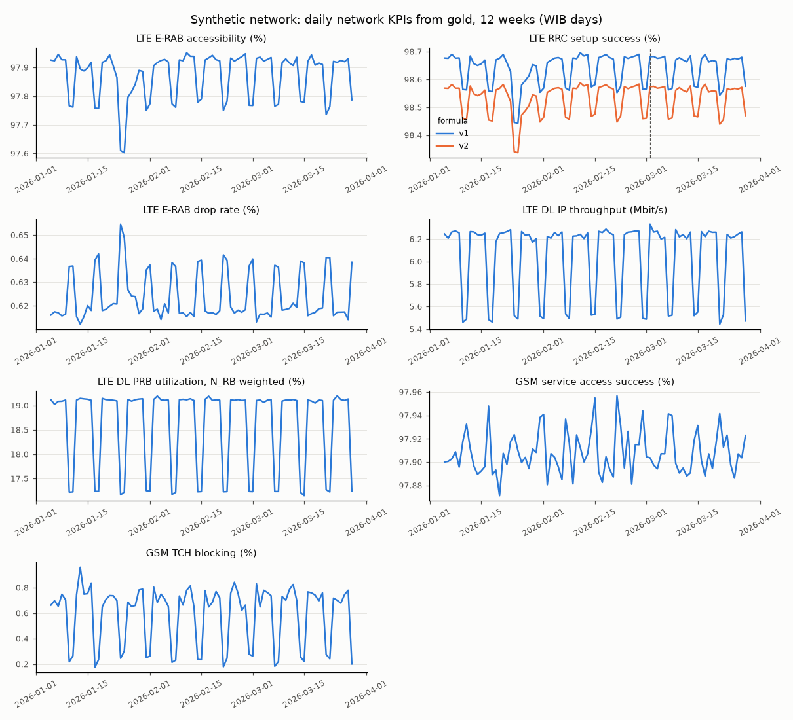
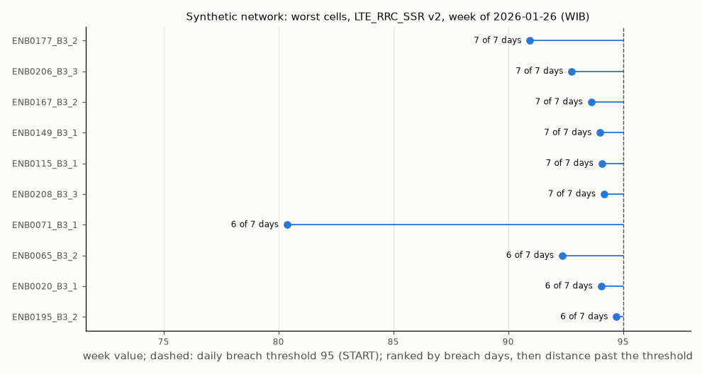
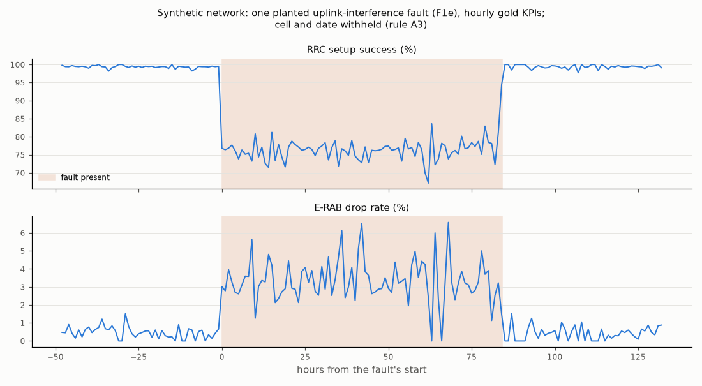

# Gold build report

Synthetic network, demo profile. 12 weeks of silver built
into gold KPIs by the dbt project (incremental merge models keyed by formula version,
rule S2), one UTC day at a time, recomputing the WIB days and weeks each day touches
(rules L3, L5, D6). Formulas: `kpi_catalog.md`. Written by
`python -m ran_lakehouse.lake.gold_report` from `gold_build.json`.

## Formula revision (rule D6)

LTE_RRC_SSR v1 to v2, current from 2026-03-02 (WIB): history reprocessed from 2026-01-04 before the build reached UTC day 2026-03-01. Both versions are kept for the whole
history. Network daily mean over the run: v1 98.638 %, v2 98.531 %.

## Agreement with the model

Every daily KPI recomputed from the simulator's own counters (same faults) against
gold, per cell and WIB day, leaving out cell-days a planted delivery anomaly changed
(D2 conflict, D3, D4). Tolerance: relative 1e-06; availability 0.556 percentage points (10 s samples).
WIB days compared: 83 of 84: the
run's last WIB day stays partial in gold (silver builds a UTC day only after it ends).
All agree: yes.

| KPI | Cell-days compared | Agreeing | Largest difference | Missing in gold |
|---|---|---|---|---|
| GSM_ABN_REL v1 | 9,372 | 9,372 | 1.78e-15 | 0 |
| GSM_CSSR v1 | 18,744 | 18,744 | 0 | 0 |
| GSM_HOSR v1 | 18,744 | 18,744 | 1.42e-14 | 0 |
| GSM_SAS v1 | 18,744 | 18,744 | 0 | 0 |
| GSM_SDCCH_BLOCK v1 | 18,744 | 18,744 | 0 | 0 |
| GSM_SDCCH_DROP v1 | 9,372 | 9,372 | 2.22e-16 | 0 |
| GSM_TCH_BLOCK v1 | 18,744 | 18,744 | 8.88e-16 | 0 |
| LTE_AVAIL v1 | 102,852 | 102,852 | 1.42e-14 | 0 |
| LTE_CQI_MEAN v1 | 102,852 | 102,852 | 0 | 0 |
| LTE_ERAB_ACC v1 | 102,852 | 102,852 | 0 | 0 |
| LTE_ERAB_DROP v1 | 102,852 | 102,852 | 4.44e-16 | 0 |
| LTE_ERAB_RET v1 | 31,896 | 31,896 | 8.88e-16 | 0 |
| LTE_IP_THP_DL v1 | 102,852 | 102,852 | 2.28e-06 | 0 |
| LTE_MOB_HOSR v1 | 102,496 | 102,496 | 1.42e-14 | 0 |
| LTE_PRB_UTIL v1 | 102,852 | 102,852 | 0 | 0 |
| LTE_RRC_SSR v1 | 102,852 | 102,852 | 1.42e-14 | 0 |
| LTE_RRC_SSR v2 | 102,852 | 102,852 | 0 | 0 |

## Coverage and suspect data

| Daily KPI rows | Cell-days | Coverage below 1 | With suspect values |
|---|---|---|---|
| LTE | 121,968 | 18,876 | 129 |
| GSM | 22,176 | 3,432 | 0 |

## Worst cells (rule L5)

Persistent: breach on 3 of 7 days of a WIB week, days judged at coverage 0.75 or more (START).

The figure: LTE_RRC_SSR v2, week of 2026-01-26, top 10 persistent cells.

| KPI | Weeks with a persistent cell | Persistent cell-weeks | Most in one week |
|---|---|---|---|
| GSM_CSSR v1 | 12 | 75 | 8 |
| GSM_HOSR v1 | 9 | 16 | 3 |
| GSM_SAS v1 | 12 | 29 | 3 |
| GSM_TCH_BLOCK v1 | 12 | 71 | 7 |
| LTE_ERAB_ACC v1 | 12 | 95 | 12 |
| LTE_ERAB_DROP v1 | 12 | 135 | 14 |
| LTE_MOB_HOSR v1 | 9 | 14 | 2 |
| LTE_PRB_UTIL v1 | 12 | 131 | 12 |
| LTE_RRC_SSR v1 | 12 | 131 | 16 |
| LTE_RRC_SSR v2 | 12 | 137 | 17 |

## Weekend throughput: a traffic-mix effect

Network DL IP throughput is lower at weekends although PRB use is lower too. Cell by
cell it is not: 1,021 of 1,452 LTE cells have a weekend throughput at
least their weekday one, and 20 have both lower throughput and lower PRB use.
At weekends traffic moves from the urban business areas, where the radio is best, to
residential and suburban cells, so the network mean falls (complete WIB days,
weekday against Saturday and Sunday):

| Area class | Day | DL IP throughput (Mbit/s) | Share of DL volume (%) | PRB utilization, N_RB-weighted (%) | Mean CQI |
|---|---|---|---|---|---|
| rural | weekday | 4.39 | 13.2 | 19.0 | 9.88 |
| rural | weekend | 4.23 | 15.7 | 19.4 | 9.88 |
| suburban | weekday | 6.57 | 52.5 | 26.6 | 9.66 |
| suburban | weekend | 6.24 | 62.4 | 27.3 | 9.66 |
| urban | weekday | 6.85 | 34.3 | 14.8 | 8.94 |
| urban | weekend | 4.9 | 22.0 | 10.9 | 8.43 |

## A faulted cell

one planted F1e fault lasting 84 h, two days either side; the planted schedule is evaluation-only (rule
A3), so the cell and the date are withheld.

## Gold tables

| Table | Rows | Data files | MB |
|---|---|---|---|
| gold.cells | 1,716 | 89 | 2.7 |
| gold.lte_cell_15m | 11,592,768 | 84 | 334.6 |
| gold.lte_cell_60m | 2,898,192 | 84 | 35.2 |
| gold.gsm_cell_15m | 2,107,776 | 84 | 25.5 |
| gold.lte_kpi_15m | 96,295,024 | 140 | 695.4 |
| gold.lte_kpi_hour | 27,008,131 | 141 | 288.2 |
| gold.lte_kpi_day | 1,135,092 | 182 | 34.0 |
| gold.lte_kpi_week | 162,156 | 110 | 20.1 |
| gold.gsm_kpi_15m | 12,646,656 | 84 | 49.1 |
| gold.gsm_kpi_hour | 3,166,416 | 84 | 17.9 |
| gold.gsm_kpi_day | 133,056 | 167 | 3.5 |
| gold.gsm_kpi_week | 19,008 | 95 | 2.2 |
| gold.worst_cells_week | 834 | 121 | 0.3 |
| gold.kpi_catalog | 17 | 2 | 0.0 |
| gold.loads | 174 | 85 | 0.1 |
| total | | | 1,509.0 |

## Cost

Measured on the build machine; varies run to run. Each dbt run is its own process.

| Step | Value |
|---|---|
| UTC days built | 84 |
| dbt runs | 98 |
| dbt runs rerun after a wall-clock step | 6 |
| seconds, days | 1,518.7 |
| seconds, revision reprocessing | 119.1 |
| seconds, build total | 1,648.7 |
| seconds, model check | 94.7 |
| peak RSS, Python (MB) | 748 |
| peak RSS, largest dbt run (MB) | 1,038 |
