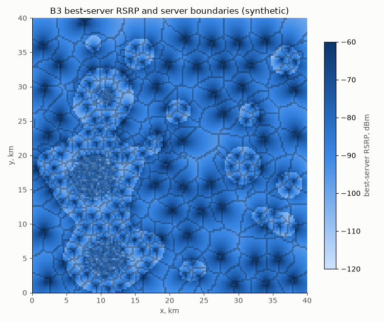
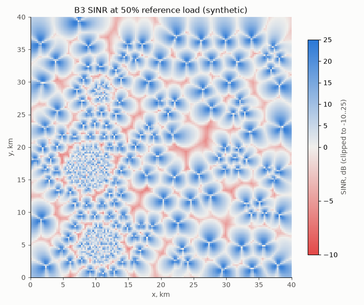
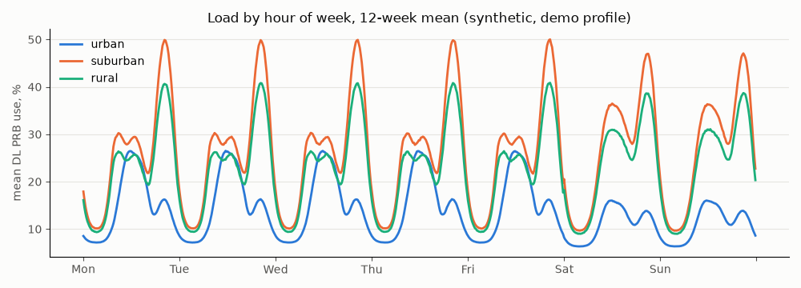
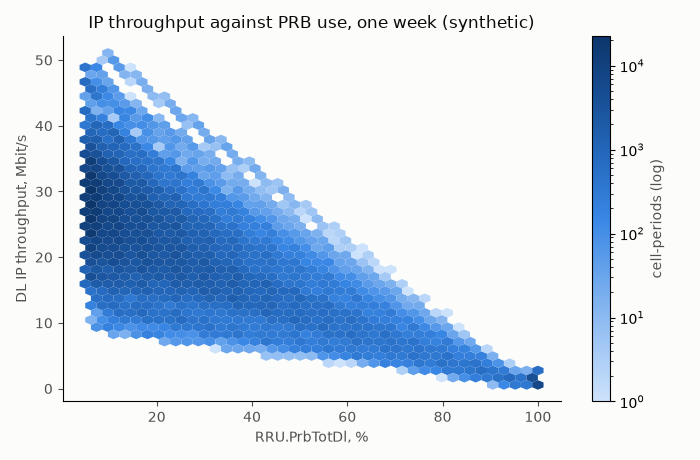
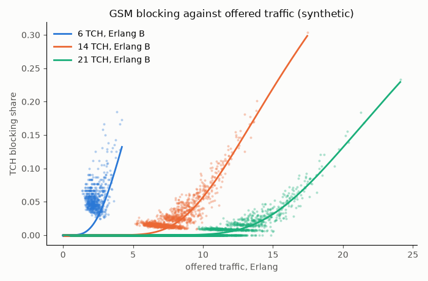

# Network model report

Synthetic network (rules M1-M5): coverage, load and 15-minute counters of the demo
profile, generated in memory. Stated simplifications (rule M7): no terrain in the served
region, no scheduler, fading or mobility traces; interference at a 50% reference load.
Written by `python -m ran_lakehouse.model.report` from `model.json`.

Model settings: coverage on a 125 m grid (each 250 m population cell split into four
points, so the smallest urban sectors span several points); default downtilts 8, 6 and
4 degrees for urban, suburban and rural sites (ASSUMPTION, typical macro tilts).

Demo: 1452 LTE and 264 GSM cells, 12 weeks, 13,837,824 cell-periods; 8110 neighbour relations; 0 persons without LTE coverage.

The blocking figure shows the three commonest TCH counts, one week of cell-periods.

## Coverage per layer

| Band | Cells | Population covered | Level p10 / p50 / p90, dBm | SINR p10 / p50 / p90, dB |
|---|---|---|---|---|
| B1 | 336 | 0.895 | -115.8 / -105.4 / -93.4 | -4.9 / 1.0 / 11.1 |
| B28 | 36 | 0.532 | -114.9 / -95.5 / -77.1 | -0.4 / 4.9 / 16.1 |
| B3 | 828 | 1.0 | -101.3 / -89.0 / -75.3 | -1.0 / 4.9 / 15.7 |
| B40 | 186 | 0.696 | -117.6 / -108.2 / -95.3 | -5.3 / 1.2 / 11.2 |
| B8 | 66 | 0.496 | -113.1 / -92.4 / -73.2 | -0.7 / 4.6 / 15.2 |
| G1800 | 90 | 0.641 | -101.7 / -95.2 / -84.5 | -0.7 / 3.3 / 10.7 |
| G900 | 174 | 1.0 | -85.4 / -63.5 / -47.0 | 6.4 / 12.3 / 23.0 |

Level is RSRP for LTE and RxLev for GSM; GSM SINR is carrier to interference plus noise.

## KPIs over the 12 weeks (ratio of sums)

| KPI | Value |
|---|---|
| LTE E-RAB accessibility, TS 32.450 6.1.1 (%) | 98.314 |
| LTE RRC setup success rate, operator-defined (%) | 98.949 |
| LTE E-RAB retainability R2, TS 32.450 6.2.1 (releases per session hour) | 0.989 |
| LTE E-RAB drop rate, operator-defined (%) | 0.559 |
| LTE DL IP throughput, TS 32.450 6.3.1 (kbit/s) | 7296.8 |
| LTE cell availability, TS 32.450 6.4.1 (%) | 100.0 |
| LTE intra-frequency handover success, HO.IntraFreqOut* (%) | 98.714 |
| LTE mean DL PRB use, operator-defined (%) | 19.01 |
| GSM service access success, TS 32.410 7.4 (%) | 97.895 |
| GSM TCH blocking, vendor-style (%) | 0.49 |
| GSM handover success per cell, TS 32.410 9.5 (%) | 96.1 |
| GSM abnormal release rate, TS 32.410 8.2 without intra-cell terms (%) | 2.62 |

## Peak congestion by area class

At each class's busiest 15-minute slot of the week (by mean PRB use), over 12 weeks:

| Class | Busiest slot | Mean PRB use, % | Cells above 80% PRB | Highest share, any slot |
|---|---|---|---|---|
| urban | Tue 11:30 | 26.5 | 0.013 | 0.03 |
| suburban | Fri 20:30 | 50.0 | 0.185 | 0.185 |
| rural | Fri 20:30 | 40.8 | 0.168 | 0.172 |

Per-cell load follows cell size. LTE subscribers per cell: urban 403, suburban 1127, rural 645. The dense city grid is lightly loaded per cell, and the towns, sited on the suburban lattice, are the network's hotspots; they are where capacity faults (rule F1d) belong. Users at urban points follow a business-hours activity curve, so the urban peak falls in the weekday daytime; suburban and rural points follow the residential curve with its evening peak (both ASSUMPTION).

## Counter invariants over every cell-period

| Invariant broken | Cell-periods |
|---|---|
| RRC.ConnEstabSucc.sum > RRC.ConnEstabAtt.sum | 0 |
| S1SIG.ConnEstabSucc > S1SIG.ConnEstabAtt | 0 |
| ERAB.EstabInitSuccNbr.sum > ERAB.EstabInitAttNbr.sum | 0 |
| HO.IntraFreqOutSucc > HO.IntraFreqOutAtt | 0 |
| succTCHSeizures > attTCHSeizures | 0 |
| succImmediateAssingProcs > attImmediateAssingProcs | 0 |
| succOutgoingInternalInterCellHDOs > attOutgoingInternalInterCellHDOs | 0 |
| RRU.PrbTotDl outside 0-100 | 0 |
| negative counter values (levels in dBm excluded) | 0 |
| DRB.IPVolDl > 0 with DRB.IPTimeDl = 0 | 0 |

## Counter relationships, first week

| Check | Statistic | Value | Expected | Result |
|---|---|---|---|---|
| IP throughput falls as PRB use rises | Spearman | -0.6138 | < 0 | pass |
| RRC setup success lower at PRB >= 95% than below 80% | success rate below 80% minus at >= 95% | 0.027 | > 0 | pass |
| E-RAB drop rate rises with cell-edge share | Spearman | 0.9887 | > 0 | pass |
| Mean CQI rises with mean SINR | Spearman | 0.9953 | > 0 | pass |
| Median TA distance grows urban < suburban < rural | median mean TA step per class | [3.993, 12.234, 29.052] | increasing | pass |
| PRB use rises with connected users | Spearman | 0.9693 | > 0 | pass |
| TCH blocking higher at TCH occupancy >= 0.8 than below 0.5 | blocking share at >= 0.8 minus below 0.5 | 0.0801 | > 0 | pass |

## GSM transceivers

Dimensioned per cell for 2% blocking at the busy hour (Erlang B), 1 to 12 TRX:

| TRX | Cells |
|---|---|
| 1 | 77 |
| 2 | 97 |
| 3 | 33 |
| 4 | 21 |
| 5 | 8 |
| 6 | 16 |
| 7 | 8 |
| 8 | 1 |
| 9 | 2 |
| 10 | 1 |

## Timing

Measured on the build machine; varies run to run.

| Step | Seconds |
|---|---|
| demo model build (coverage and serving) | 30.9 |
| demo 12 weeks of counters | 17.0 |
| tiny build and 2 days | 0.0 |

Tiny profile: 27 cells, 2 days, 2739774 RRC setup attempts.
