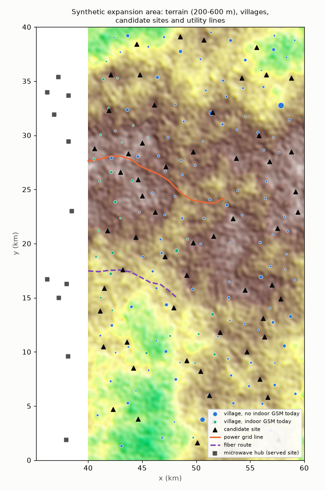
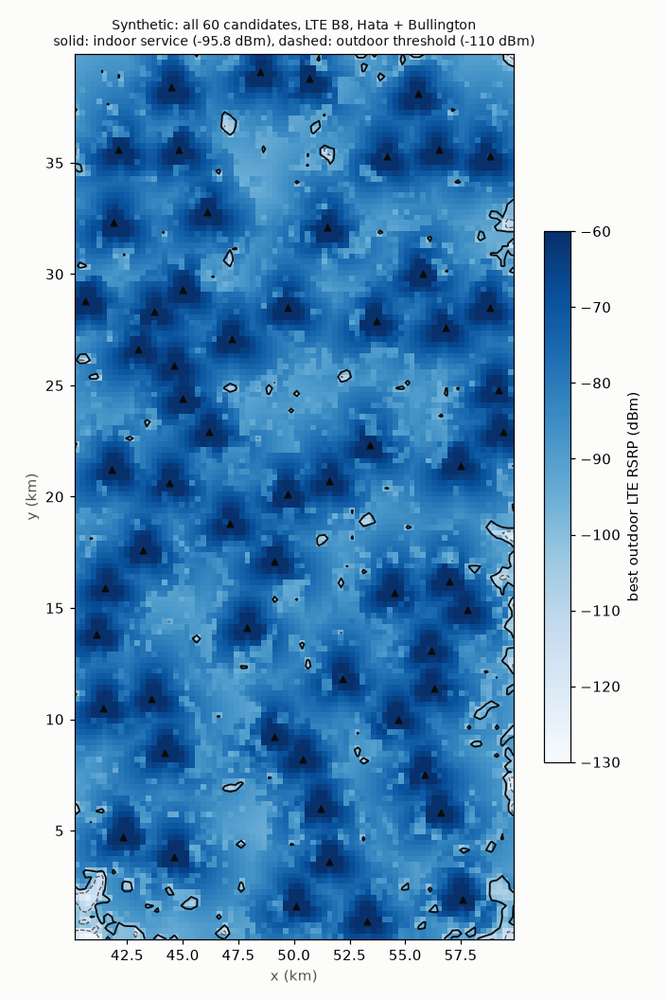
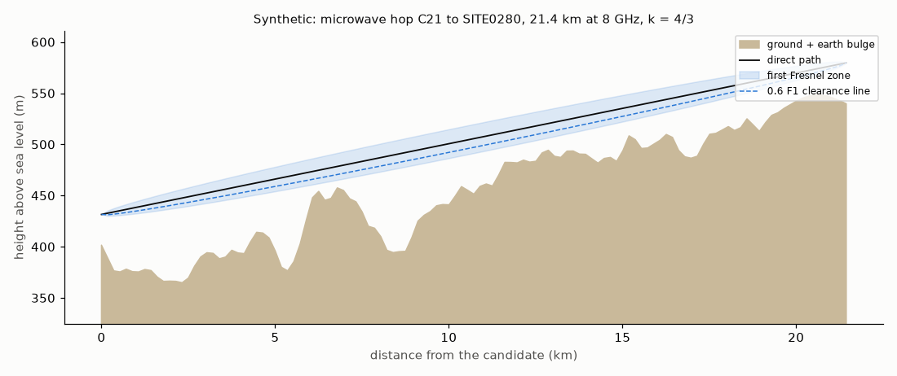

# Planning geography report

Synthetic expansion area of the demo profile (rules G1 to G7): terrain,
villages, candidate sites, coverage and backhaul, all generated from the world's seed.
Written by `python -m ran_lakehouse.planning.report` from `planning.json`.

## Service today (rule G1)

The expansion area has little or no usable indoor service today; some villages see
weak outdoor coverage from the served edge. The served cells' levels at each village
use the model's Hata plus the same Bullington diffraction over the terrain as the
candidates. Service coverage is indoor: the outdoor level must clear the threshold by
the indoor margin (14.2 dB, the ITU-R P.2109-2 median for traditional buildings; village housing is
modelled as that class, ASSUMPTION).

| Villages | Count |
|---|---|
| all | 150 (176,284 persons, 143 schools) |
| outdoor LTE (RSRP at threshold) | 23 |
| outdoor GSM (RxLev at threshold) | 60 |
| indoor LTE (covered_today_lte) | 1 |
| indoor GSM (covered_today_gsm) | 31 |
| persons without indoor LTE | 175,424 |
| persons without indoor GSM | 145,462 |

## Candidates and coverage (rules G4, G5)

61 hilltops qualify and 60 are kept (cap 60, by persons nearby): each village's highest hilltop within 3 km, kept 1.5 km apart, so they cluster
where villages do. A greedy cover serves every village some candidate serves with 31 candidates (LTE indoor) or 16 (GSM indoor); elevation 314.4 to 577.7 m; build cost 1,809,046,186 to 2,112,228,296 IDR (ASSUMPTION).

| Coverage from candidates | Value |
|---|---|
| villages with indoor LTE from some candidate | 146 |
| villages with indoor GSM from some candidate | 150 |
| villages per candidate, indoor LTE (min / median / max) | 2 / 7 / 13 |
| area share with indoor LTE from all candidates | 96.6% |
| area share with outdoor LTE from all candidates | 99.5% |

## Backhaul and power (rule G6)

The figure: the longest clear hop, C21 to SITE0280, 21.4 km.
The gold table uses the 0.6 F1 clearance; the 1.0 F1 count is beside it.

| Option (spreads are min / median / max) | Value |
|---|---|
| fiber spur km | 0.08 / 10.72 / 23.62 |
| microwave clear at 0.6 F1 (used) | 56 |
| microwave clear at 1.0 F1 (P.530-19 2.2.2.1) | 55 |
| microwave hop km | 2.51 / 12.25 / 21.45 |
| satellite | 60 |
| hubs | 11 |
| power: grid | 14 |
| power: solar | 46 |

## Sources

- diffraction: ITU-R P.526-16 (11/2025) Annex 1 clause 4.5.1 (Bullington model), eqs (49) to (57), with J(v) from clause 4.1 eq (31)
- fresnel: ITU-R P.530-19 (09/2025) clause 2.2.1 eq (3)
- clearance: ITU-R P.526-16 clause 2.3 and P.530-19 clause 2.2.2: 60% of the first Fresnel zone gives free-space conditions; P.530-19 clause 2.2.2.1 plans for 1.0 F1 at median k
- thresholds: 3GPP sets no planning threshold: TS 36.133 V19.5.0 clause 9.1.4 gives the RSRP reporting range (-156 to -44 dBm); TS 45.005 V19.0.0 clause 6.2 the GSM 900 reference sensitivity (-104 dBm BTS, -102 dBm small MS)
- indoor margin: ITU-R P.2109-2 (08/2023) Annex 1 clause 3, median building entry loss at 0.9 GHz, horizontal incidence, traditional buildings (village housing, ASSUMPTION)
- ITU-R P.2109-2 median at 0.9 GHz (dB): traditional 14.2; thermally-efficient 31.2

## Parameters

| Parameter | Value |
|---|---|
| relief_m (START) | 200 / 600 |
| terrain spectral exponent (START) | 3.2 |
| terrain grid km (ASSUMPTION) | 0.1 |
| persons per school (START) | 1,500 |
| school from persons (START) | 500 |
| candidate sites (START) | 60 |
| candidate spacing km (START) | 1.5 |
| candidate near a village within km (START) | 3 |
| mast height m (START) | 30 |
| LTE B8 power dBm, N_RB (rule M) | 46 / 50 |
| GSM 900 BCCH power dBm (rule M) | 43 |
| LTE RSRP threshold dBm (START) | -110 |
| GSM RxLev threshold dBm (START) | -100 |
| indoor margin dB (ITU-R P.2109-2, traditional buildings) | 14.2 |
| microwave GHz (START) | 8 |
| Fresnel clearance used (START) | 0.6 |
| hub zone km, hub antenna m, max hop km (START) | 4 / 40 / 30 |
| grid power within km (START) | 5 |
| satellite Mbps (START) | 8 |
| costs IDR (ASSUMPTION) | build base 1,800,000,000; access road per km 120,000,000; fiber per km 150,000,000; microwave link 350,000,000; satellite terminal 150,000,000; satellite monthly 25,000,000; grid line per km 250,000,000; solar and battery 650,000,000 |

## Gold tables (rule G7)

| Table | Rows |
|---|---|
| gold.villages | 150 |
| gold.candidate_sites | 60 |
| gold.coverage | 18,000 |
| gold.backhaul_power_options | 300 |

## Cost

| Step | Value |
|---|---|
| seconds, network model and plan | 28.1 |
| seconds, total | 39.4 |
| peak RSS (MB) | 744 |
