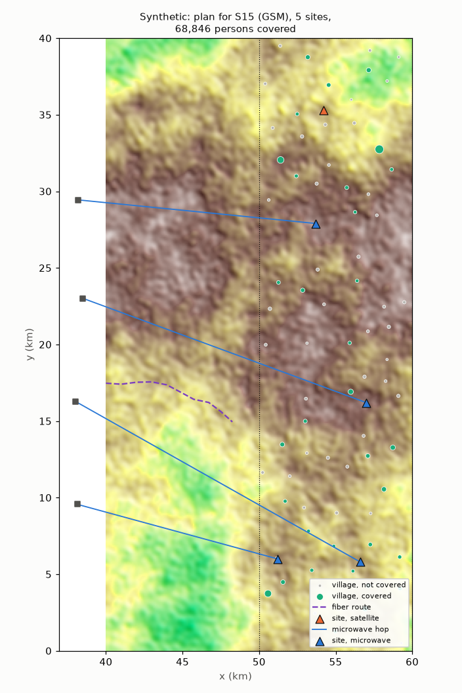

# Planning scenarios and solver report

Synthetic expansion area of the demo profile (rules G8, G9). 20 scenario cards: a written request and an area are public
(gold.planning_scenarios); the constraint set each implies and its exact optimum are
evaluation-only (evaluation.planning_answers, rule A3). Constraint schema:
`contract/plan_constraints.schema.json` (version 1.0.0). Written by
`python -m ran_lakehouse.planning.scenario_report` from `planning_scenarios.json`.

## Solver comparison

One 0-1 integer program, built once as an OR-Tools MathOpt model (OR-Tools
9.15.6755) and solved to a zero gap by each bundled solver: the objective first, then
the cheapest plan at that optimum, then each constraint relaxed in turn to price it.
HiGHS and SCIP get each row divided by its largest coefficient (unscaled IDR rows
near 1e10 made SCIP stop 40 persons short on S16); CP-SAT solves in integers. Every
plan returned is checked against the unscaled integer rows.
Median of 3 runs per card; time limit 60 s per solve; 1 thread for CP-SAT
and SCIP (HiGHS takes no thread count through MathOpt), so the pick holds on any
machine: CP-SAT proved every card with 16 workers on the build machine but not
with 4 on the CI runner.

| Back end | Total s | Largest card s | Proven (optimal or infeasible) | Time limit |
|---|---|---|---|---|
| highs | 3.762 | 1.801 | 20 of 20 | 0 |
| cpsat | 256.183 | 65.596 | 18 of 20 | 2 |
| scip | 3.34 | 1.494 | 20 of 20 | 0 |

The back ends that prove every card agree on each card's status and objective: yes. Chosen: **scip** (every card proven, least total time); it serves both the stored optima and the plan solve.

## Scenarios

| Difficulty / status | Cards |
|---|---|
| easy / optimal | 5 |
| hard / optimal | 5 |
| infeasible / infeasible | 3 |
| medium / optimal | 7 |

| Card | Area | Request |
|---|---|---|
| S01 | north | Plan LTE for the northern half. Use at most 6 sites and cover as many people as possible. |
| S02 | south | In the south, which 5 sites would reach the most villages with GSM? |
| S03 | whole | Find the cheapest set of sites that gives indoor 2G to every village with a school. |
| S04 | west | West strip: cover at least 80% of the population with LTE at the lowest capital cost. |
| S05 | whole | Where should 3 LTE sites go to reach the most people? |
| S06 | east | Tolong buat plan 4G untuk area timur, budget capex maksimal 15 miliar rupiah, target populasi sebanyak mungkin. |
| S07 | north-east | North-east corner: both 2G and 4G, no more than 5 sites, most people covered, and opex must stay under 40 juta per month. |
| S08 | whole | Every village above 3,000 people needs indoor LTE. Minimize capex, and use fiber only where the route is within 2 km. |
| S09 | south-west | GSM for the south-west: villages 157 and 89 must be covered, then as many other people as possible with 3 sites. |
| S10 | central | Central area LTE: at least 70% of people, microwave only where the full first Fresnel zone clears, lowest capex. |
| S11 | whole | Semua desa dengan sekolah harus dapat 2G. Maksimal 14 site, sisanya maximize jumlah desa yang tercover. |
| S12 | west | West strip, GSM: the cheapest plan that reaches 95% of the people. |
| S13 | whole | 2G for the whole area within 40 billion rupiah capex and 150 million a month opex. Every school village covered; maximize people. |
| S14 | north | Northern half, both technologies, at least 90% of people, at most 12 sites, capex under 30 billion. Minimize capex. |
| S15 | east | East strip: grid power only within 2 km (solar otherwise), fiber within 4 km. All villages above 1,000 people plus village 91 get 2G; opex under 60 juta/bulan; minimize capex. |
| S16 | whole | Kita ada budget 45 miliar dan max 20 site. Target: 4G indoor untuk sebanyak mungkin orang, tapi desa di atas 3.000 jiwa wajib tercover. |
| S17 | south | South half, both 2G and 4G: maximize villages covered with at most 8 sites, monthly cost under 80 million, and full Fresnel clearance for any microwave hop. |
| S18 | whole | Cover every village with a school with 2G using only 5 sites. |
| S19 | north | Utara: 4G untuk 99% penduduk dengan capex maksimal 10 miliar. |
| S20 | whole | Every village with a school must get indoor 4G. Find the cheapest plan. |

Infeasible cards and what to relax:

- S18: relax must_cover: its villages cannot all be served within the rest; relax max_sites to 13
- S19: relax min_persons_share to 0.4951
- S20: drop must_cover: no candidate serves villages 177, 199, 203

## Worked scenario: S15 (hard)

Request: "East strip: grid power only within 2 km (solar otherwise), fiber within 4 km. All villages above 1,000 people plus village 91 get 2G; opex under 60 juta/bulan; minimize capex."

Constraint set it implies:

```json
{
  "schema_version": "1.0.0",
  "area": {
    "x_min_km": 50.0,
    "x_max_km": 60.0,
    "y_min_km": 0.0,
    "y_max_km": 40.0
  },
  "objective": "min_capex",
  "technology": "GSM",
  "must_cover": {
    "schools": false,
    "min_persons": 1000,
    "village_ids": [
      91
    ]
  },
  "max_sites": null,
  "capex_budget_idr": null,
  "monthly_opex_limit_idr": 60000000,
  "power_rule": {
    "grid_within_km": 2.0
  },
  "backhaul_rule": {
    "fiber_within_km": 4.0,
    "microwave_clearance": 0.6
  },
  "min_persons_share": null
}
```

Plan: 5 sites, 33 villages and 68,846 persons covered, capital cost 14,476,089,570 IDR, monthly cost 40,500,000 IDR.

| Site | Backhaul | Hub | Power |
|---|---|---|---|
| C01 | microwave | SITE0279 | solar |
| C07 | satellite |  | solar |
| C09 | microwave | SITE0278 | solar |
| C18 | microwave | SITE0280 | solar |
| C31 | microwave | SITE0281 | solar |

Cost of each constraint (the objective gained by solving again without it; integer
programs have no dual prices). A constraint is binding when that gain is not zero;
with whole sites it can bind while the plan leaves some of it unused:

| Constraint | Limit | Used | Binding | Objective gain without it |
|---|---|---|---|---|
| must_cover | 33 | 33 | yes | 14476089570 |
| monthly_opex | 60000000 | 40500000 | yes | 800000000 |



## Cost

Report run 830.1 s, peak RSS 774 MB (network model, planning data, every card solved by every back end). Solves rerun after a
wall-clock step of the build machine: 1.
