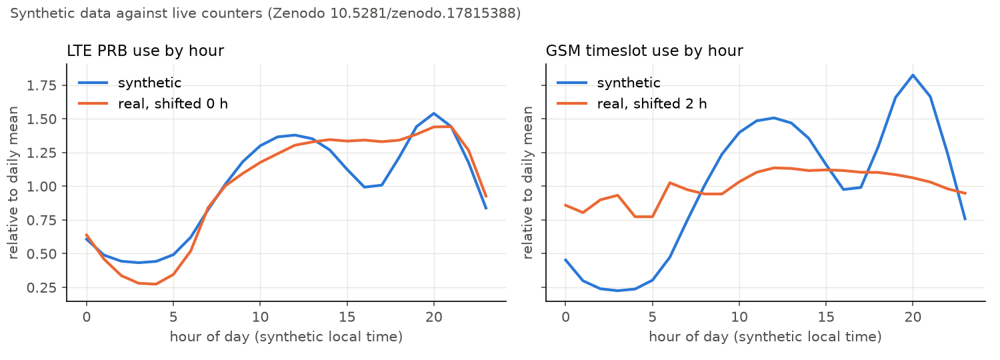
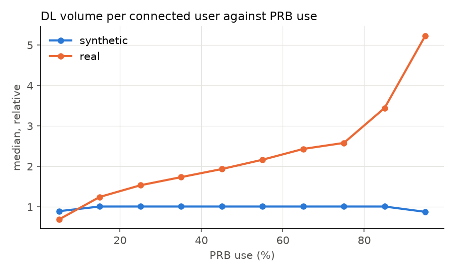
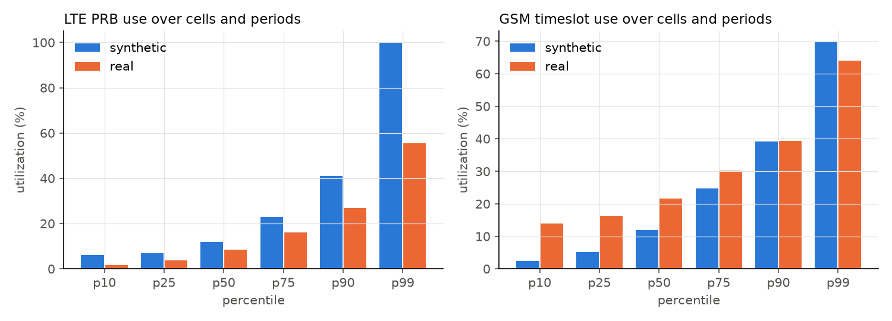

# Real-data cross-check

The synthetic network (rule E2) against live counters: "Performance Management Counters from Live 5G, 4G and 2G Radio Access Network", Zenodo 10.5281/zenodo.17815388, CC BY 4.0. Written by `python -m ran_lakehouse.crosscheck.report` from `real_data_crosscheck.json`; the real data is fetched by `python -m ran_lakehouse.crosscheck.fetch` and never committed. Only aggregated statistics and figures derived from it are here.

Real: Dataset_03/Baseband_02/Dataset_03_LTE_1800.csv, Dataset_03/Baseband_01/Dataset_03_GSM_900.csv; LTE 5,606,202 rows from 749 sectors, GSM 5,595,932 rows from 746 sectors, 2025-08-31 23:45:00 to 2025-11-22 23:30:00 (UTC). Synthetic: the demo profile, clean (no planted fault), days 0 to 83, 1452 LTE and 264 GSM cells.

Shapes only: absolute levels differ by design (a different network, mix and market) and the real record does not give its units in its README.

## Diurnal load

Mean by hour of day divided by the daily mean. The real timestamps are UTC and the record does not state the local zone, so the real curve is shifted by the whole number of hours that best matches the synthetic one (WIB local time).

| Series | Shift (h) | Pearson r after the shift |
|---|---|---|
| LTE PRB use | 0 | 0.9433 |
| GSM timeslot use | 2 | 0.7717 |

## Data volume per connected user against PRB use

The real set has no active-time counter, so throughput (volume over active time, the KPI the lake computes) cannot be formed from it. Both sides use the same proxy instead: DL data volume per mean RRC-connected user in a 15-minute period, over periods with at least 1 connected user, as a median per PRB-use bin divided by the overall median.

| PRB use (%) | 0-10 | 10-20 | 20-30 | 30-40 | 40-50 | 50-60 | 60-70 | 70-80 | 80-90 | 90-100 |
|---|---|---|---|---|---|---|---|---|---|---|
| synthetic | 0.8931 | 1.0087 | 1.0091 | 1.0089 | 1.0088 | 1.0088 | 1.0088 | 1.0089 | 1.0087 | 0.8769 |
| real | 0.6891 | 1.245 | 1.534 | 1.7351 | 1.9351 | 2.1653 | 2.4323 | 2.5813 | 3.445 | 5.232 |

Spearman correlation of the proxy with PRB use: synthetic 0.2262, real 0.7018 (on a sample of up to 200,000 periods each). For reference, the synthetic network's own DL IP throughput against PRB use: -0.6163.

## Spread of utilization

Percentiles over every cell and 15-minute period.

| Series | p10 | p25 | p50 | p75 | p90 | p99 |
|---|---|---|---|---|---|---|
| LTE PRB use, synthetic | 6 | 7 | 12 | 23 | 41 | 100 |
| LTE PRB use, real | 1.68 | 3.76 | 8.44 | 16.2 | 26.87 | 55.59 |
| GSM timeslot use, synthetic | 2.36 | 5.17 | 11.93 | 24.72 | 39.11 | 69.62 |
| GSM timeslot use, real | 13.98 | 16.3 | 21.67 | 30.14 | 39.38 | 64.03 |

## What the comparison shows

- Diurnal load: after the shift the shapes agree with Pearson r 0.9433 (LTE) and 0.7717 (GSM).
- Volume per connected user: from the lowest to the highest PRB-use bin the real median goes from 0.6891 to 5.232 times its overall median, the synthetic from 0.8931 to 0.8769. In the model every connected user asks for the same demand (rule M4, ASSUMPTION), so PRB use rises only with the number of users; in the live network heavier users also drive PRB use. This is a gap of the model, stated, not changed here.
- Spread: median LTE PRB use is 12% synthetic against 8.44% real, p99 100% against 55.59%; GSM timeslot use p10 is 2.36% synthetic against 13.98% real (the live network shows a floor the model does not).

## Not compared

Success-rate spread: the real set carries no setup, success or drop counters for LTE or GSM, so it cannot be compared with this data.

## Attribution

Peter Lehoczký, Matúš Turcsány, Laura Krajčovičová, Filip Zatroch, Marcel Kajan and Marek Galinski. Performance Management Counters from Live 5G, 4G and 2G Radio Access Network [Dataset]. Zenodo. https://doi.org/10.5281/zenodo.17815388 (2026). CC BY 4.0.

Changes: the counters were aggregated into the statistics and figures above; no row of the data is reproduced.

## Cost

Report run 50.7 s, peak resident set 2299 MB.
