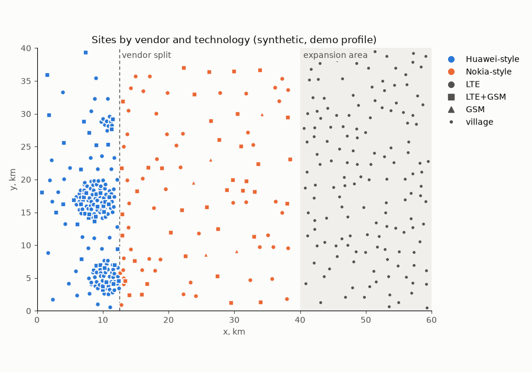
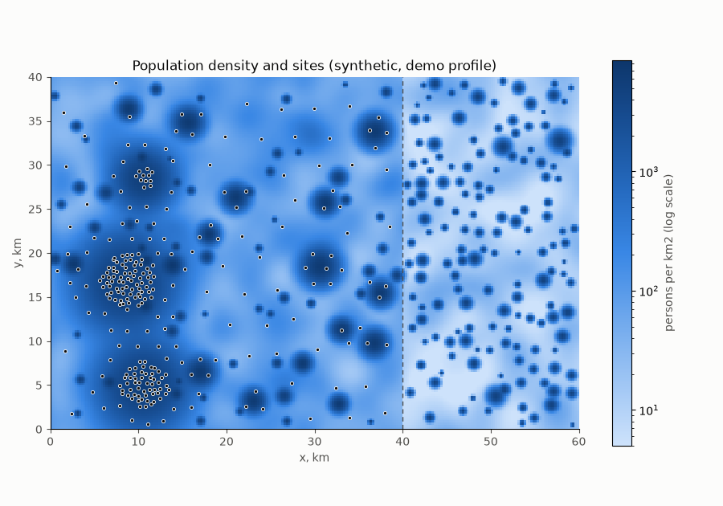
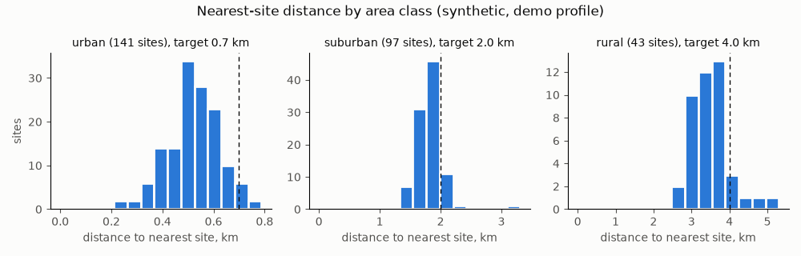

# World report

Synthetic world (rule W): the map, population, sites and cells are generated from seeds
(rule W1); no real operator, network, site, city or person, and no real coordinates
(rule W2). Written by `python -m ran_lakehouse.world.report` from `world.json`.

## Demo profile

Map 60.0 x 40.0 km; served region x < 40.0 km, expansion area east of it (rule W3).

### Population

| Item | Value |
|---|---|
| total | 1390320 |
| served region | 1201779 |
| expansion area | 188542 |
| expansion village | 150 |
| served city | 3 |
| served town | 16 |
| served village | 60 |

| Served area class | km2 |
|---|---|
| urban | 61.94 |
| suburban | 393.75 |
| rural | 1144.31 |

### Sites

| Item | Sites |
|---|---|
| total | 281 |
| area class urban | 141 |
| area class suburban | 97 |
| area class rural | 43 |
| vendor huawei | 183 |
| vendor nokia | 98 |
| Huawei-style share | 0.651 |
| technology GSM | 5 |
| technology LTE | 193 |
| technology LTE+GSM | 83 |

### Cells

| Item | Cells |
|---|---|
| total | 1716 |
| technology GSM | 264 |
| technology LTE | 1452 |
| LTE share of cells | 0.846 |
| band B1 | 336 |
| band B28 | 36 |
| band B3 | 828 |
| band B40 | 186 |
| band B8 | 66 |
| band G1800 | 90 |
| band G900 | 174 |
| class EUtranCellFDD | 1266 |
| class EUtranCellTDD | 186 |
| class GsmCell | 264 |
| vendor huawei | 1134 |
| vendor nokia | 582 |

### Nearest-site distance, km

| Area class | Sites | p10 | Median | p90 |
|---|---|---|---|---|
| urban | 141 | 0.39 | 0.52 | 0.65 |
| suburban | 97 | 1.58 | 1.81 | 2.07 |
| rural | 43 | 3.06 | 3.49 | 4.0 |

## Tiny profile

Map 11.0 x 4.0 km; 5 sites, 27 cells (B1 9, B3 15, G900 3).

## Notes

- Inter-site distance (ISD) means the lattice spacing: sites sit on a hexagonal lattice spaced at the START ISD of their area class, each jittered in x and y by up to a fraction of it (urban 30%, suburban 15%, rural 15%), so the distance to the nearest site runs below the lattice spacing. Median nearest-site distance against lattice ISD: urban 0.52 of 0.7 km (0.74), suburban 1.81 of 2.0 km (0.91), rural 3.49 of 4.0 km (0.87).
- Every site stays at least 0.5 km inside the map edge; lattice points jittered outside that margin are dropped.
- Area classes are judged on density smoothed over 1.5 km (ASSUMPTION), so a village reads as rural and a town as a whole; a site closer than 0.7 of its class ISD to a denser class's site is dropped (ASSUMPTION).
- Vendor regions: sites west of x = 12.5 km are Huawei-style (0.651 of sites), the rest Nokia-style; 5 of 141 urban sites fall east of the split, on the eastern edges of the cities. The split is a design choice (rule P5), and the border through a city is intended: cells on an inter-vendor border are a real optimization pain point.
- Technology (rule W6, shares of cells): LTE 0.846 of cells; GSM on 88 of 281 sites, 5 of them GSM-only rural sites; 1.75 LTE layers per LTE site on average.
- Tiny profile (rule W7): 5 sites and 27 cells from the same generator and band rules.
- Names: DNs follow TS 32.300 V19.0.0 clause 7. Class names are the XML solution-set spellings (TS 28.659 V20.0.0 for E-UTRAN; TS 28.656 V19.0.0 for GERAN: BssFunction, BtsSiteMgr, GsmCell), where the TS 28.655 information model writes BSSFunction, BTSSiteMgr, GSMCell.

## Determinism

SHA-256 over sites, cells and the population raster (rule W1); a test rebuilds both
profiles and compares.

| Profile | SHA-256 |
|---|---|
| demo | 763dbf5652bb5b9fdc50b2275b595da5fb63052d46b4f3fbd9d2cb7080590e84 |
| tiny | 708ba63770b56a6756662ef66b355981813011853e6b83ee3a19f8b42d4321d5 |

## START and ASSUMPTION values

| Parameter | Value |
|---|---|
| raster_km (W4, START) | 0.25 |
| urban_min_density_per_km2 (START) | 2900.0 |
| suburban_min_density_per_km2 (START) | 850.0 |
| isd_km (START) | {"urban": 0.7, "suburban": 2.0, "rural": 4.0} |
| site_jitter_fraction (urban START, else ASSUMPTION) | {"urban": 0.3, "suburban": 0.15, "rural": 0.15} |
| map_edge_margin_km (START) | 0.5 |
| min_spacing_fraction (ASSUMPTION) | 0.7 |
| class_smoothing_km (ASSUMPTION) | 1.5 |
| sectors (W6, ASSUMPTION) | 3 |
| azimuth_jitter_sd_deg (ASSUMPTION) | 10.0 |
| gsm_cosite_share (START) | {"urban": 0.25, "suburban": 0.3, "rural": 0.6} |
| lte_extra_layer_p (START; B3 on every LTE site) | {"urban": {"B1": 0.6, "B40": 0.3}, "suburban": {"B1": 0.3, "B40": 0.15}, "rural": {"B8": 0.5, "B28": 0.3}} |
| demo vendor_split_x_km (START, design choice) | 12.5 |
| demo gsm_only_share_rural (START) | 0.08 |
| demo rural density served/expansion per km2 (ASSUMPTION) | [80.0, 15.0] |
| demo settlements (START) | {"city": [3, 150000.0], "town": [16, 20000.0], "served villages": [60], "expansion villages": [150]} |
